# Clinic Management System Technical Documentation

## 1. 📌 Project Overview

The Clinic Management System is a microservice-based web application for handling two main workflows:

1. Patient submission of medical intake forms.
2. Admin review, update, and export of submitted forms.

The system separates authentication, form processing, routing, and frontend concerns into distinct services. This keeps responsibilities clear and makes deployment and maintenance easier.

## 2. 🔄 Main Business Flow

- A patient opens the frontend and fills in a medical form.
- The frontend sends the form to the API Gateway.
- The API Gateway routes the request to the Submit Service.
- The Submit Service validates and stores the data in MariaDB.
- An admin logs in through the frontend.
- The frontend sends credentials to the API Gateway, which routes the request to the Auth Service.
- The Auth Service authenticates the admin and returns a JWT token.
- The frontend uses that token for protected admin operations.
- The admin can list forms, inspect a single form, update diagnosis/notes/status fields, and export a PDF report.

## 3. 🏗️ High-Level Architecture

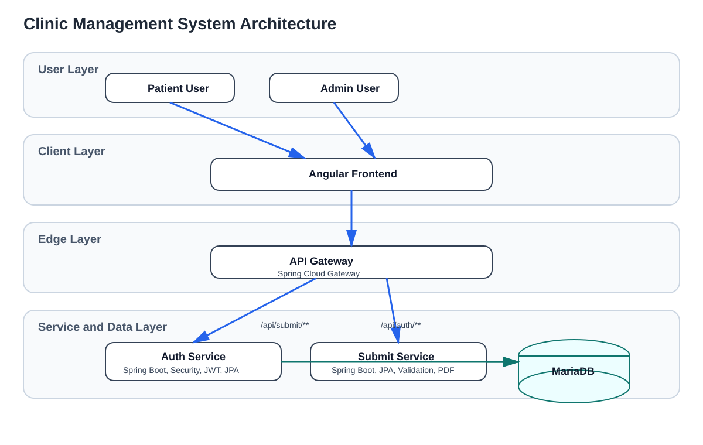

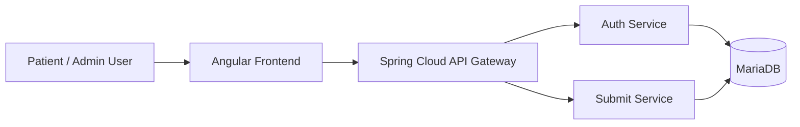

## 4. 🧭 Detailed Architecture Diagram

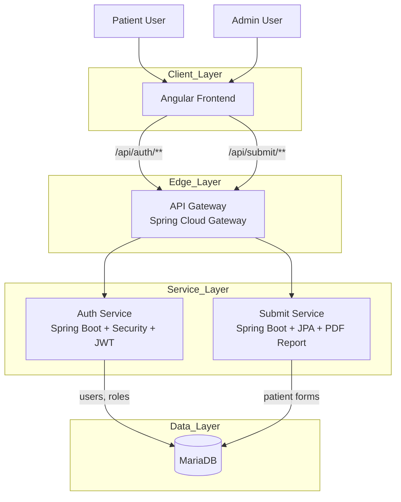

## 5. 🧩 Services and Responsibilities

### Frontend

- Technology: Angular 21
- Main role: user interface for patients and admins
- Important modules:
  - `home`
  - `login`
  - `patient-dashboard`
  - `admin-dashboard`
  - `signature-pad`
  - `auth`
  - `i18n`

Frontend routing currently includes:

- `/home`
- `/login`
- `/patient-dashboard`
- `/admin-dashboard`

### API Gateway

- Technology: Spring Cloud Gateway
- Main role: single entry point for backend APIs
- Routes configured:
  - `/api/auth/**` -> `auth-service`
  - `/api/submit/**` -> `submit-service`
- Also provides centralized CORS handling

### Auth Service

- Technology: Spring Boot, Spring Security, Spring Data JPA
- Main role: admin authentication and JWT generation
- Main endpoint:
  - `POST /api/auth/login`
- Core classes:
  - `AuthController`
  - `JwtService`
  - `CustomUserDetailsService`
  - `SecurityConfig`
  - `JwtAuthenticationFilter`
- Persistence model:
  - `User`
  - `Role`
- Seed behavior:
  - creates `ROLE_ADMIN`
  - creates default admin user `admin/admin`

### Submit Service

- Technology: Spring Boot, Spring Security, Spring Data JPA
- Main role: patient form submission and admin-side management
- Main endpoints:
  - `POST /api/submit/forms`
  - `GET /api/submit/forms`
  - `GET /api/submit/forms/{id}`
  - `PATCH /api/submit/forms/{id}/admin`
  - `GET /api/submit/forms/{id}/report.pdf`
- Core classes:
  - `PatientFormController`
  - `PatientFormService`
  - `ReportService`
  - `SimplePdfReportGenerator`
  - `SecurityConfig`
  - `JwtAuthenticationFilter`
  - `JwtProvider`

### Database

- Technology: MariaDB 11
- Main role: persistent storage for users, roles, and submitted patient forms
- Docker volume is used for persistence

## 6. 🛠️ Technology Stack

### Backend

- Java 17
- Spring Boot 4.0.5
- Spring Security
- Spring Data JPA
- Spring Cloud Gateway
- JWT (`jjwt`)
- Lombok
- Hibernate Validator

### Frontend

- Angular 21
- TypeScript
- RxJS

### Infrastructure and DevOps

- Docker
- Docker Compose
- Nginx for frontend container serving
- GitLab CI / SAST

### Testing Tools Present in the Repository

- Spring Boot test starters
- Angular unit testing
- Playwright end-to-end tests
- Vitest

## 7. 🚀 Deployment View

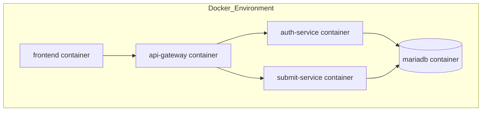

## 8. 🔐 Authentication and Authorization Flow

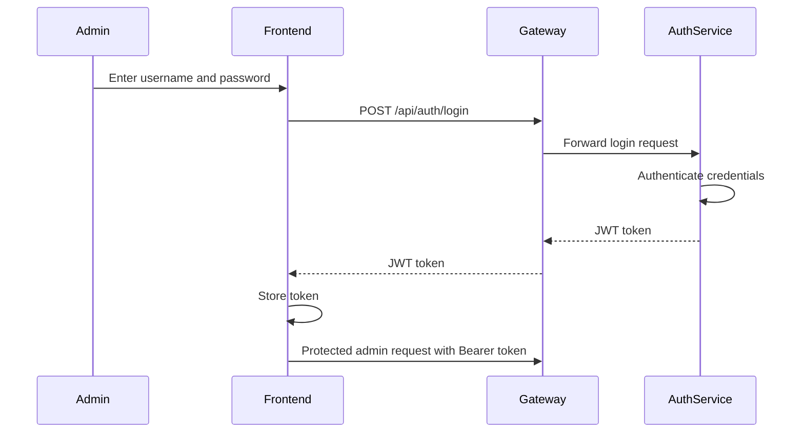

## 9. 📝 Patient Form Submission Flow

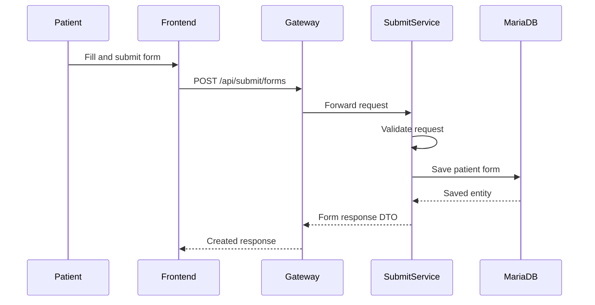

## 10. 👥 Use Case Diagram

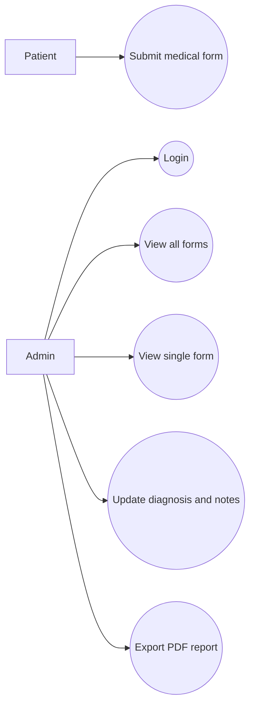

## 11. 🧱 Core Domain UML Class Diagram

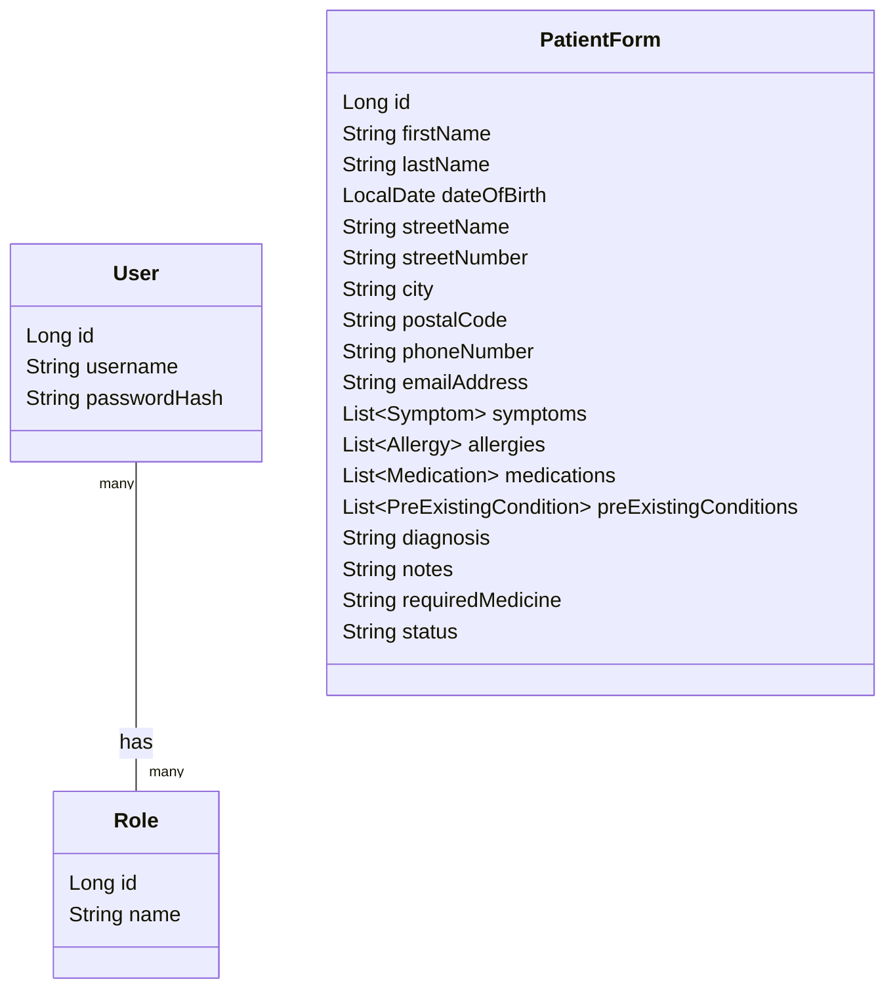

## 12. 🧩 UML Component Diagram

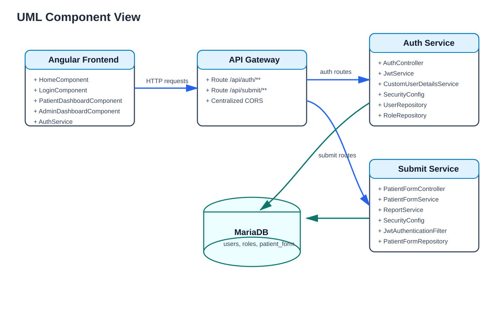

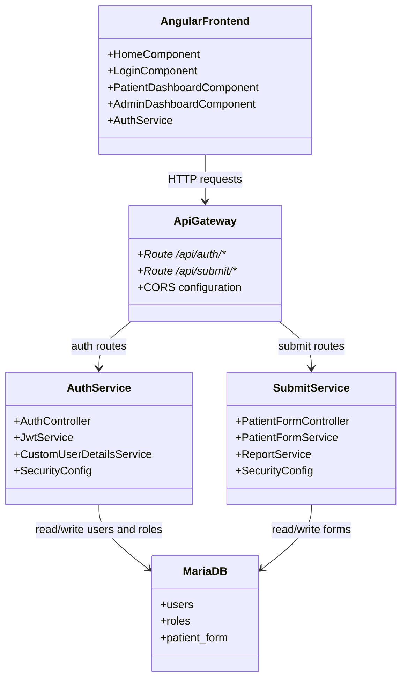

## 13. 🗃️ Simplified Data Model

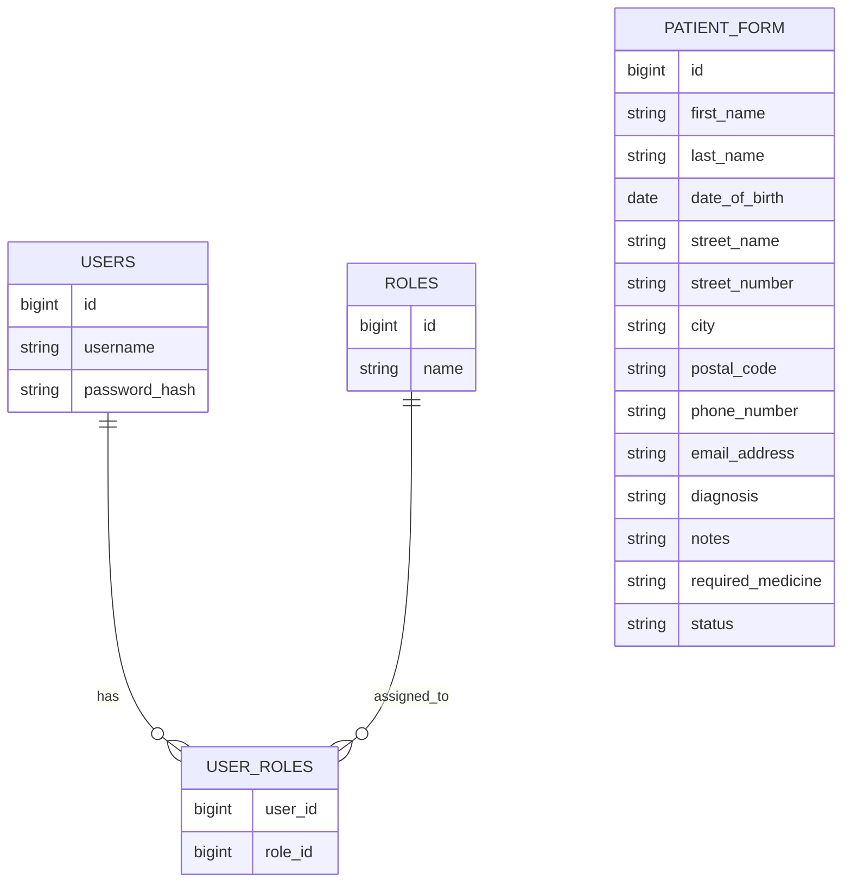

## 14. 🛡️ Security Design

- JWT-based stateless authentication is used for admin access.
- Login is handled by the Auth Service.
- Protected endpoints in Submit Service require authentication.
- Method-level authorization is used for admin-only operations.
- Public access is intentionally allowed for:
  - `POST /api/submit/forms`
  - `OPTIONS /**`
  - `/actuator/**`

## 15. 🔧 Technical Tools Used

### Application Development

- IntelliJ IDEA or any Java IDE
- Visual Studio Code or any frontend IDE
- Maven Wrapper (`mvnw`, `mvnw.cmd`)
- npm
- Angular CLI

### Backend Libraries

- Spring Boot
- Spring Security
- Spring Data JPA
- Spring Cloud Gateway
- JJWT
- Lombok
- Hibernate Validator

### Frontend Libraries

- Angular
- RxJS
- TypeScript

### Infrastructure Tools

- Docker
- Docker Compose
- MariaDB
- Nginx

### Quality and Testing Tools

- JUnit through Spring test starters
- Playwright
- Vitest
- GitLab SAST

### Diagram Tools Recommended for Maintenance

- Mermaid in Markdown
- draw.io
- PlantUML

## 16. 📐 Suggested Future Diagrams

If you want to extend the technical documentation later, these diagrams would add value:

- Detailed class diagram for `PatientFormService` and DTO mapping
- Component diagram for Angular modules and services
- Sequence diagram for PDF generation
- Deployment diagram for production hosting
- Database schema diagram including element collection tables

## 17. 📎 Current Architectural Notes

- The system follows a microservice split, but both backend services currently share the same MariaDB server instance.
- Authentication is separated from form processing, which is the correct boundary for future scaling.
- The API Gateway centralizes routing and CORS concerns.
- The current root `README.md` still contains template content and should be replaced with project-specific documentation later.
